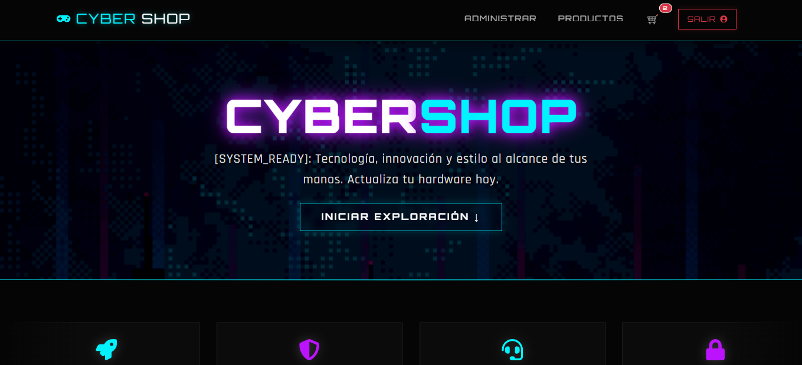
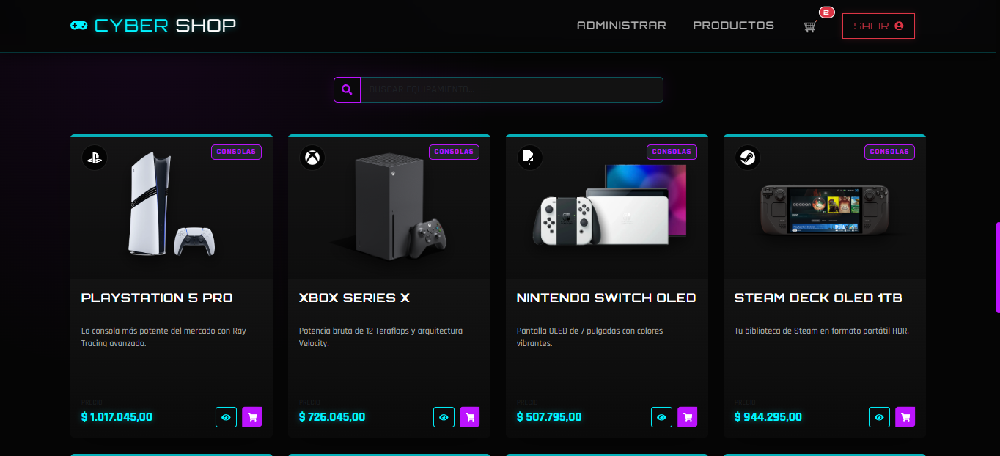
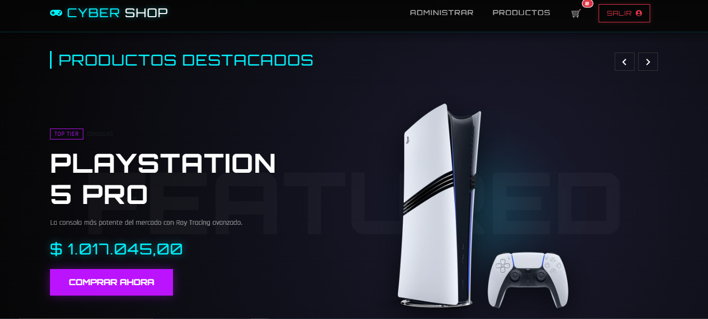
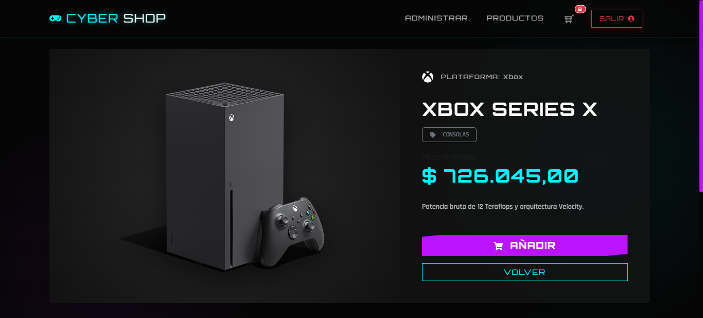
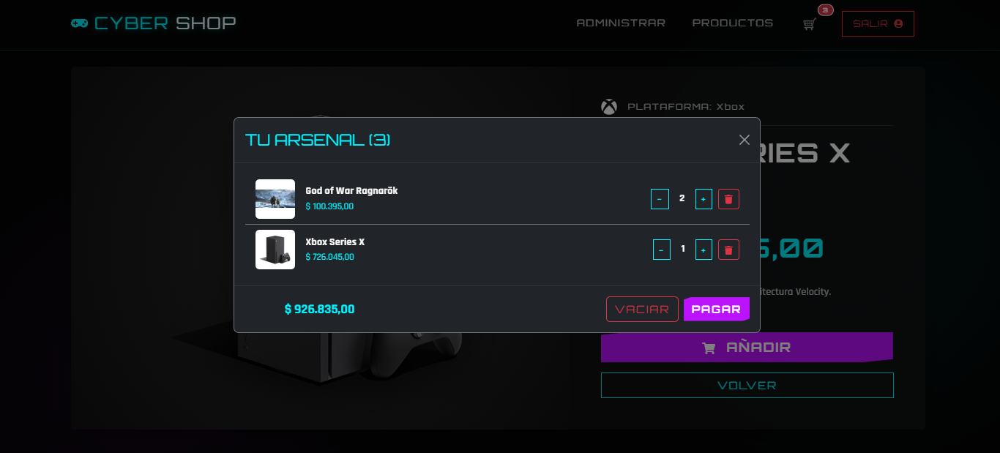
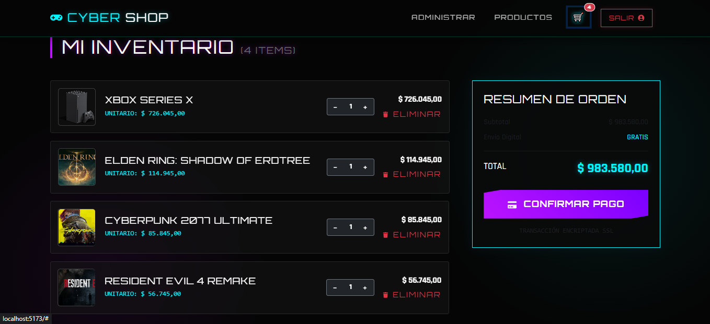
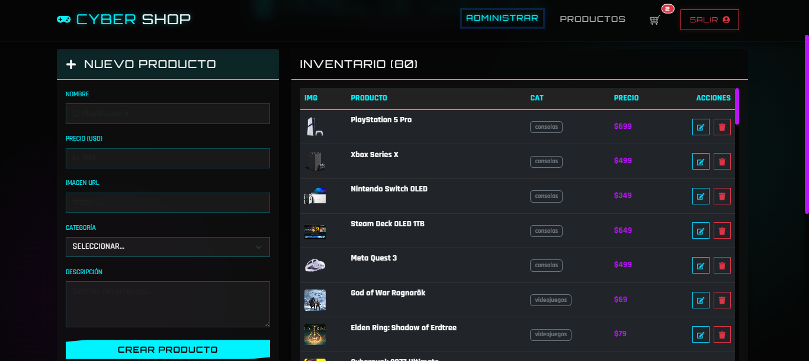
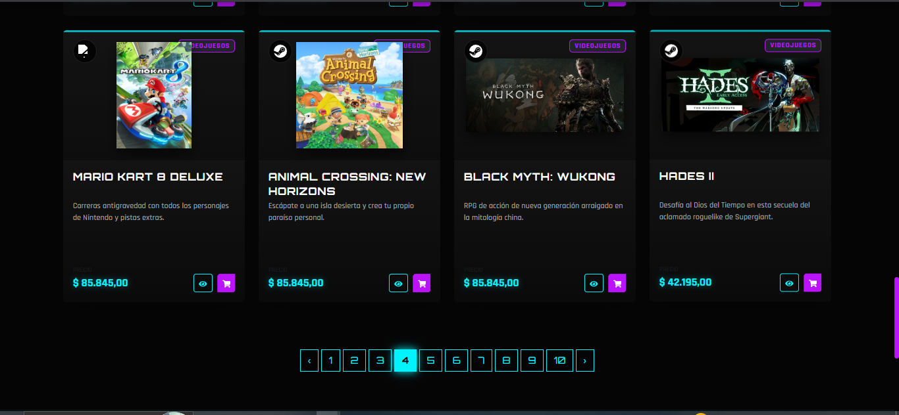
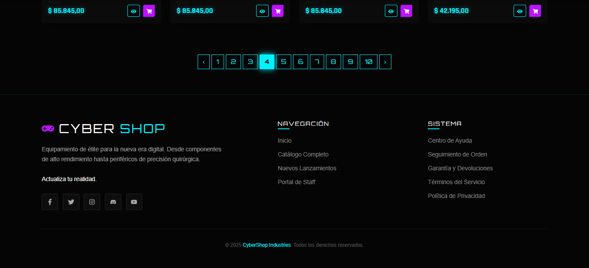

# 🎮 CyberShop - E-commerce Gamer & Tech



<div align="center">

**Proyecto Final - Curso React JS | Talento Tech**

[](https://reactjs.org/)
[](https://getbootstrap.com/)
[](https://reactrouter.com/)
[](https://vercel.com/)

---

### 🎓 Información del Curso
**Programa:** Talento Tech  
**Tutor:** Ezequiel Mondino (ezequiel.mondino@bue.edu.ar)  
**Instructor:** Nicolás Fernández (nicolas.fernandez4@bue.edu.ar)  
**Alumno:** Tomás Zarriello

</div>

---

## 📝 Descripción del Proyecto

**CyberShop** es una plataforma de comercio electrónico SPA (Single Page Application) desarrollada con **React JS**. El proyecto simula una tienda de tecnología de alta gama con una estética **Cyberpunk/Neón**.

La aplicación permite a los usuarios navegar por un catálogo de productos, filtrar por categorías, ver detalles específicos, administrar un carrito de compras y gestionar el inventario a través de un panel de administración. Se ha hecho énfasis en la experiencia de usuario (UX), el diseño responsivo y la persistencia de datos mediante API.

---

## 🚀 Funcionalidades Principales

### 1. Navegación y Catálogo
Experiencia fluida con **React Router DOM**.
- **Vista Principal:** Carrusel de productos destacados y grilla de productos con paginación.
- **Filtrado:** Buscador en tiempo real y filtrado por categorías (Consolas, Videojuegos, Periféricos, Componentes).
- **Diseño:** Tarjetas de producto con efectos *hover* y estética neón.

| Catálogo General | Sección Destacados |
|:---:|:---:|
|  |  |

### 2. Detalle de Producto
Vista individual dinámica (`/product/:id`) que muestra:
- Imagen en alta calidad.
- Descripción detallada.
- Precio y botón de compra directo.
- Navegación intuitiva para volver al catálogo.



### 3. Gestión del Carrito (Context API)
Lógica global de estado para el carrito de compras.
- **Modal Rápido:** Vista previa del carrito sin salir de la navegación actual.
- **Vista Completa:** Página dedicada al resumen de la orden.
- **Controles:** Aumentar/disminuir cantidad, eliminar ítems y vaciar carrito.
- **Cálculo Total:** Suma dinámica de precios.

| Modal de Carrito | Vista de Inventario |
|:---:|:---:|
|  |  |

### 4. Panel de Administración (CRUD)
Sección protegida para la gestión de la base de datos (MockAPI).
- **Listado:** Tabla visual de todos los productos en stock.
- **Creación:** Formulario validado para agregar nuevos productos.
- **Edición/Eliminación:** Controles directos para modificar o borrar ítems.



---

## 🛠️ Stack Tecnológico

* **Core:** React JS (Vite)
* **Estilos:** React Bootstrap, Styled Components, CSS Modules (Estética Neón/Dark Mode).
* **Enrutamiento:** React Router DOM v6.
* **Estado Global:** React Context API (CartContext, AuthContext).
* **Datos:** Fetch API consumiendo MockAPI.io.
* **Utilidades:**
    * `react-icons`: Iconografía vectorial.
    * `react-toastify`: Notificaciones al usuario.
    * `framer-motion`: Animaciones de interfaz.
    * `react-helmet-async`: SEO y títulos dinámicos.

---

## 📸 Galería de Interfaz

<details>
<summary><strong>Ver más capturas de pantalla</strong></summary>

### Grilla de Productos y Categorías


### Paginación & Footer Institucional


</details>

---

## ⚙️ Instalación y Despliegue

### Ejecutar localmente

1.  Clonar el repositorio:
    ```bash
    git clone [https://github.com/Tommyx66/EntregaFinal_CyberShop_Zarriello.git](https://github.com/Tommyx66/EntregaFinal_CyberShop_Zarriello.git)
    ```
2.  Instalar dependencias:
    ```bash
    cd EntregaFinal_CyberShop_Zarriello
    npm install
    ```
3.  Iniciar servidor de desarrollo:
    ```bash
    npm run dev
    ```

### Despliegue
La aplicación está desplegada en **Vercel** y puede visitarse en el siguiente enlace:

🔗 **[https://entrega-final-cyber-shop-zarriello.vercel.app/#/login]**

---

<div align="center">
  <p>Desarrollado con 💜 por <strong> Tommy </strong></p>
  <p>&copy; 2025 CyberShop </p>
</div>